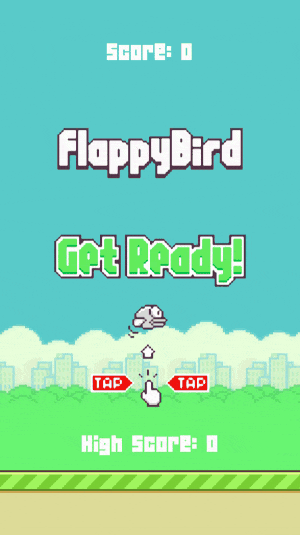

# Flappy Bird
I'm currently learning Python through [Exercism](https://exercism.org/), but I've wanted to try out a few of the concepts in real project. I saw[Clear Code's](https://www.youtube.com/@ClearCode) Flappy Bird tutorial and thought it was a great chance to try a few things out.

## Demo

## What I Learnt
### The Basics
- **Pygame:** Does a lot of things Python can't do natively, like draw images, play sounds, check for input without pausing the entire code, and also has useful tooks for things like timers, collisions, and displaying text.
- **The Event Loop:** The part of the code which checks for events like player inputs and timers, so that the individial frame can be updated in response.  
- **Surfaces:** The *display durface* is the game window and is unique and always visible; other *surfaces* are images placed on the display surface, flexible in number and only visible when on the display surface
- **Rects**: Really useful in combination with surfaces, as it allows more precise placement of images and also helpful for collisions.
- **Blit:** Block Image Transfer (used in screen.blit)
- **Text:** Treated a bit like any other image; import it, place it on a surface, blit it onto the display surface.
- **Sound and mixer**: When trying to make the game music play, it was very distorted if I used the guide's method of pygame's sound module. Instead, I had to switch to using the mixer module and implement that using the Pygame docs.
- **Animation**: Essentially just simple logic to cycle through the animation frames; can use a timer or variable to do this, resetting a variable when it hits max, or switching based on previous values with a timer.
- **Collisions**: A couple of different methods using Pygame's built in collision handling for rects and for sprites.

### More Advanced
- **Memory management:** Wouldn't have thought it a big deal in a game like this, but at the start where I was constantly spawning obstacles, I noticed how quickly the game slowed down if they weren't destroyed after leaving the screen. Important to keep things like that in mind!

### Other Thoughts
- **Loops:** For (hah) some reason, Python's loop syntax is something I struggle with; by making this and the [Pixel Runner](https://github.com/SurfingElectron/endless-runner) game, it's helping to sink it in a little more.

## Future Improvements
- **Bug Fixes:** Sometimes collisions trigger right at the start of the game, and I'm not sure why!
- **Sprites:** After working on the [Pixel Runner](https://github.com/SurfingElectron/endless-runner) game, it would be interesting to convert the bird and pipes to sprites.
- **Game over:** Briefly display a game over screen, then switch back to the instructions.

### Resources
- Sprites and audio from [Samuel Custodio](https://github.com/samuelcust/flappy-bird-assets) (provided with MIT license)